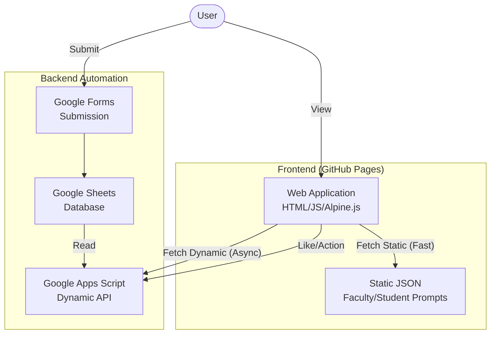

# Academic AI Prompts Database

A shared and searchable database of AI prompts specialized for academic research and educational activities. The goal is to create a platform where researchers and students can share effective prompts as "wisdom" and utilize them mutually.

## 📖 Design Concepts

### 1. Library of Wisdom
Accumulate and visualize "effective prompts," which often remain as personal knowledge, as assets for the entire academic community.

### 2. User-Centric Design
- **Modern UI**: Clean design using TailwindCSS.
- **Dark Mode**: Eye-friendly dark mode for long research sessions.
- **Responsive**: Comfortable viewing on PC, tablets, and smartphones.

### 3. Open & Collaborative
- **GitHub Power**: Data is managed transparently as JSON on GitHub.
- **Community Driven**: Anyone can contribute via a simple Google Form submission process.

---

## 🏗 System Architecture

This project is built serverless to minimize maintenance costs and maximize performance.

### Technology Stack
- **Frontend**: HTML5, Alpine.js, TailwindCSS (Hosted on GitHub Pages)
- **Backend**: Google Apps Script (GAS) Web App
- **Data Store**: 
    - **Static Content**: JSON files hosted on GitHub (Faculty/Student prompts)
    - **Dynamic Content**: Google Sheets via GAS (Shared/Request prompts, Likes)

---

### Setup Instructions
1. **Google Apps Script (GAS)**
   - Open your Google Sheet and go to `Extensions > Apps Script`.
   - Copy the content of `promptGitHub.gs` into the script editor.
   - **Deploy** as a Web App:
     - Execute as: `Me`
     - Who has access: `Anyone`
   - **Important**: If updating, always select **"New Version"** when deploying.
   - Copy the generated **Web App URL**.

2. **Frontend Configuration**
   - Open `js/app.js`.
   - Update `const GAS_API_URL` with your Web App URL.

3. **Deploy to GitHub Pages**
   - Push main branch to GitHub.
   - Go to Repository Settings > Pages.
   - Select `main` branch (or `docs` folder if configured) as source.

### File Structure
- `index.html`: Main Application
- `js/app.js`: Application Logic (Alpine.js)
- `promptGitHub.gs`: GAS Backend Code (Run on Google)
- `data/`: Static JSON data (Faculty/Student prompts)

---

## 🚀 Future Roadmap

List of potential features and improvements currently under consideration.

### Phase 1: Improve Data Quality & Searchability
- [ ] **Enhanced Tagging**: Subdivision by field (STEM, Humanities, Social Sciences) and usage.
- [ ] **Prompt Quality Score**: Feature to show output examples.
- [ ] **Multilingual Support**: Integration of translation features for prompts themselves, not just the UI.

### Phase 2: Community Features
- [ ] **User Authentication**: Visualize contribution history via GitHub Login.
- [ ] **Comments**: Suggestions and discussions for prompt improvements.
- [ ] **Curator System**: Mechanism to certify high-quality prompts.

### Phase 3: Ecosystem
- [ ] **Browser Extension**: Extension to call prompts directly on ChatGPT/Claude.
- [ ] **API Access**: Enable external tools to access the database.
